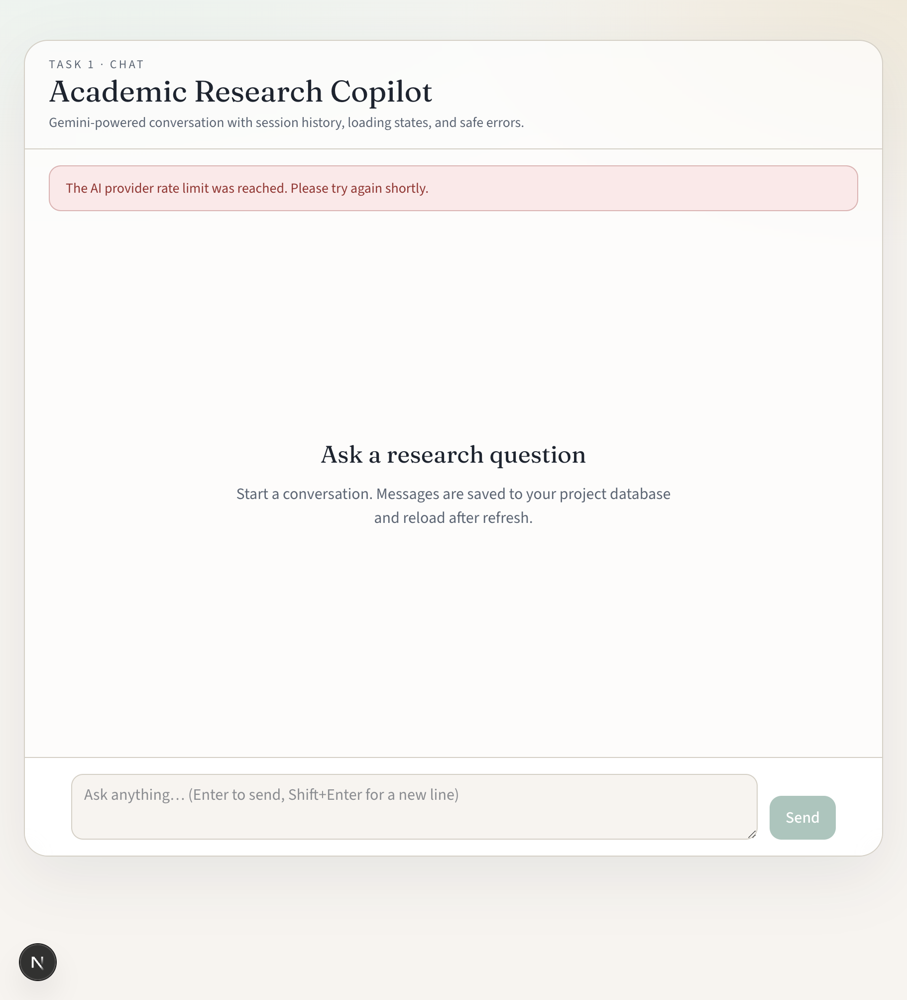

# Academic Research Copilot

AI-assisted research web app for students and researchers: LLM chat, project-scoped PDF RAG with citations, tool-calling agent, and a Prompt Lab.

**Current milestone: Task 1 — First AI Chatbot**

Gemini-powered conversational chat with durable history, loading states, and safe error handling.

## Objectives (Task 1)

- Integrate a Large Language Model API (Google Gemini)
- Build a simple, usable chat interface
- Handle API failures gracefully (no stack traces in the UI)
- Persist conversation history across refresh
- Show a loading indicator while generating responses
- Keep a clean monorepo structure (`apps/web` + `apps/ai-service`)

## Features (Task 1)

- Chat UI with Enter-to-send / Shift+Enter newline
- Loading indicator while the model responds
- Conversation history stored in **Prisma Postgres** (survives refresh and server restart)
- User-safe API error messages
- Google Gemini via the official `google-genai` Python SDK (server-side only)
- Dev identity via `X-User-Id` (real auth in Task 5)

## Technologies

| Layer | Stack |
|---|---|
| Frontend | Next.js (App Router), TypeScript, Tailwind CSS |
| Backend | FastAPI, Pydantic, SQLAlchemy |
| LLM | Google Gemini (`gemini-2.0-flash`) |
| Database | Prisma Postgres (Prisma ORM for schema/migrations; SQLAlchemy for AI-service reads/writes) |

## Repository layout

```text
academic-research-copilot/
├── apps/
│   ├── web/           # Next.js + TypeScript frontend + Prisma schema
│   └── ai-service/    # FastAPI + Python backend (Gemini + chat APIs)
├── docs/              # Architecture, API, demos, screenshots
├── Tasks/             # Program task briefs
├── .env.example
├── AGENTS.md
└── README.md
```

## Local setup

### 1. Environment

```bash
cp .env.example .env
cp apps/web/.env.local.example apps/web/.env.local
```

In root `.env`, set:

- `GEMINI_API_KEY` — from [Google AI Studio](https://aistudio.google.com/apikey)
- `DATABASE_URL` — Prisma Postgres connection string (also present in `apps/web/.env` after `prisma postgres link`)

Never put secrets in `NEXT_PUBLIC_*` variables.

### 2. AI service

```bash
cd apps/ai-service
python3 -m venv .venv
source .venv/bin/activate
pip install -e '.[dev]'
uvicorn app.main:app --reload --port 8000
```

### 3. Web app

```bash
cd apps/web
npm install
npm run dev
```

Open [http://localhost:3000](http://localhost:3000).

### 4. Database (already linked in this project)

```bash
cd apps/web
npx prisma migrate dev
npx prisma db seed
npx prisma studio   # optional browser for tables
```

## Tests

```bash
# Backend (fake LLM — no live Gemini calls)
cd apps/ai-service && source .venv/bin/activate && pytest

# Frontend
cd apps/web && npm test
```

## Screenshots




## Demo

Follow [`docs/demo-script.md`](docs/demo-script.md) for a 2–3 minute walkthrough.

## Project structure notes

- `apps/web/features/chat` — chat panel, composer, message list
- `apps/web/lib/api.ts` — typed client (`NEXT_PUBLIC_API_BASE_URL` + `X-User-Id`)
- `apps/ai-service/app/providers/llm.py` — `LLMProvider` protocol + Gemini adapter
- `apps/web/prisma/` — Prisma schema + migrations
- `apps/ai-service/app/repositories/postgres_store.py` — chat persistence via SQLAlchemy

## Known limitations (Task 1)

- Auth is a development `X-User-Id` header (not production auth)
- No PDF/RAG yet (Task 2)
- No tool routing yet (Task 3)
- Starter Prisma `User`/`Post` models coexist with chat tables and can be replaced later

## Guides

- [`AGENTS.md`](AGENTS.md)
- [`apps/web/AGENTS.md`](apps/web/AGENTS.md)
- [`apps/ai-service/AGENTS.md`](apps/ai-service/AGENTS.md)
- [`docs/api.md`](docs/api.md)
- [`docs/linkedin-task1-draft.md`](docs/linkedin-task1-draft.md)

## Roadmap

- Task 2: PDF upload, pgvector RAG, grounded citations
- Task 3: Agent router + calculator / weather / web search
- Task 4: Prompt Lab
- Task 5: Unified UI, Docker, deploy, full portfolio package
