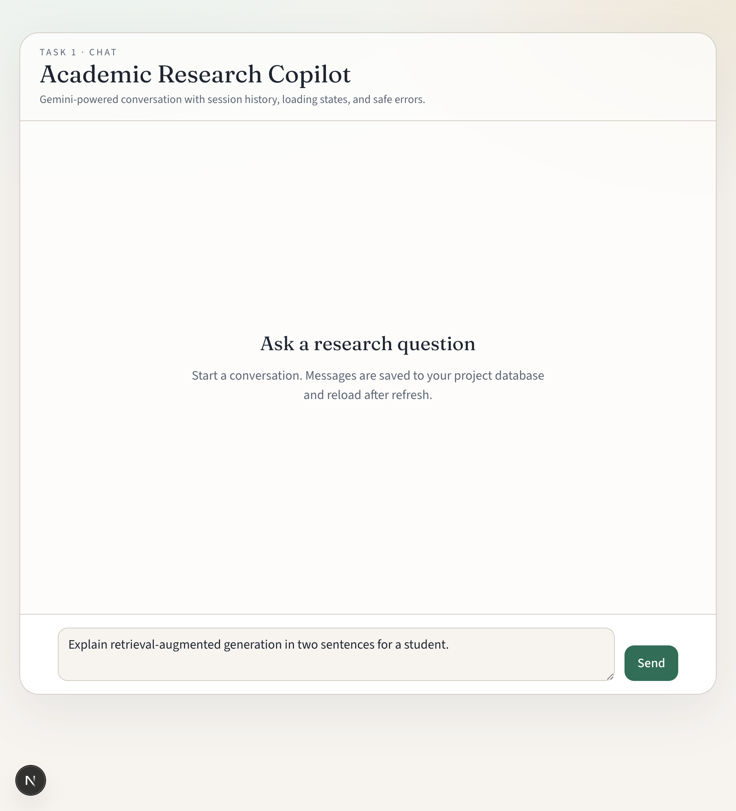
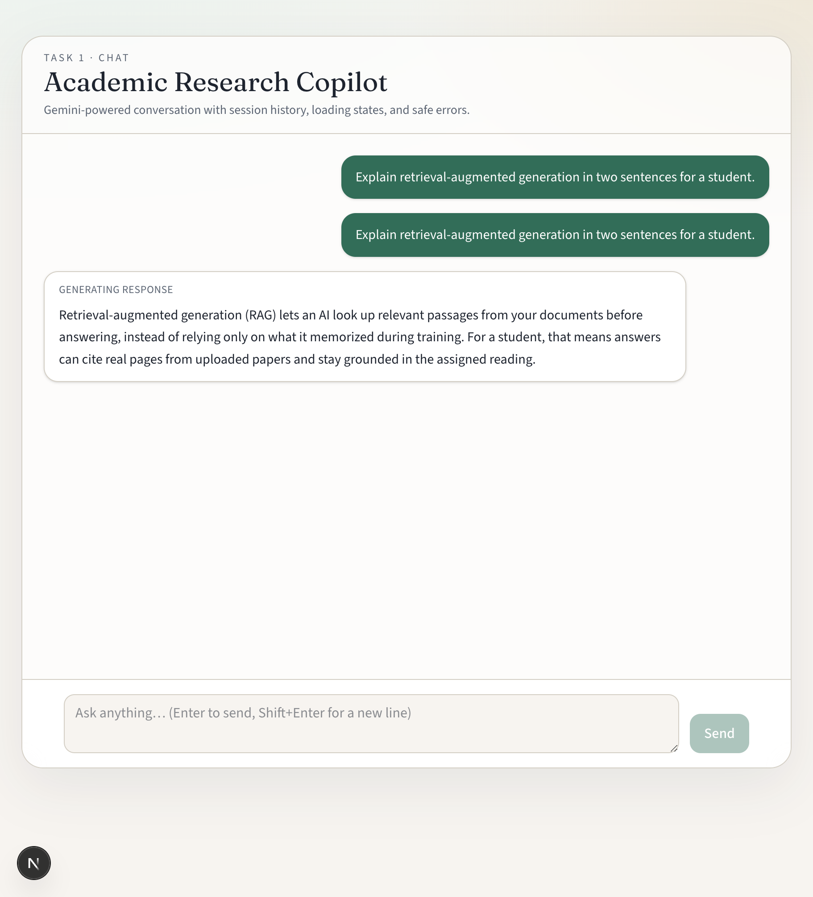
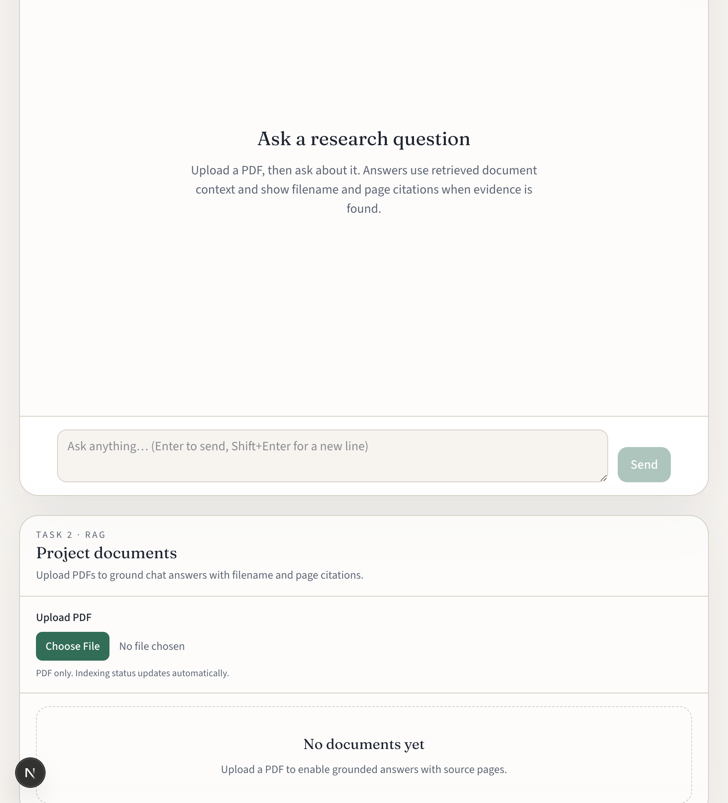
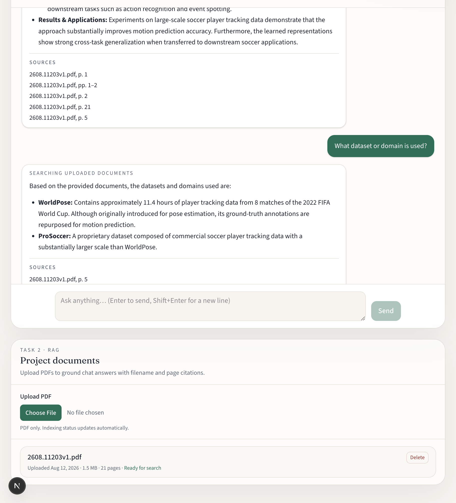
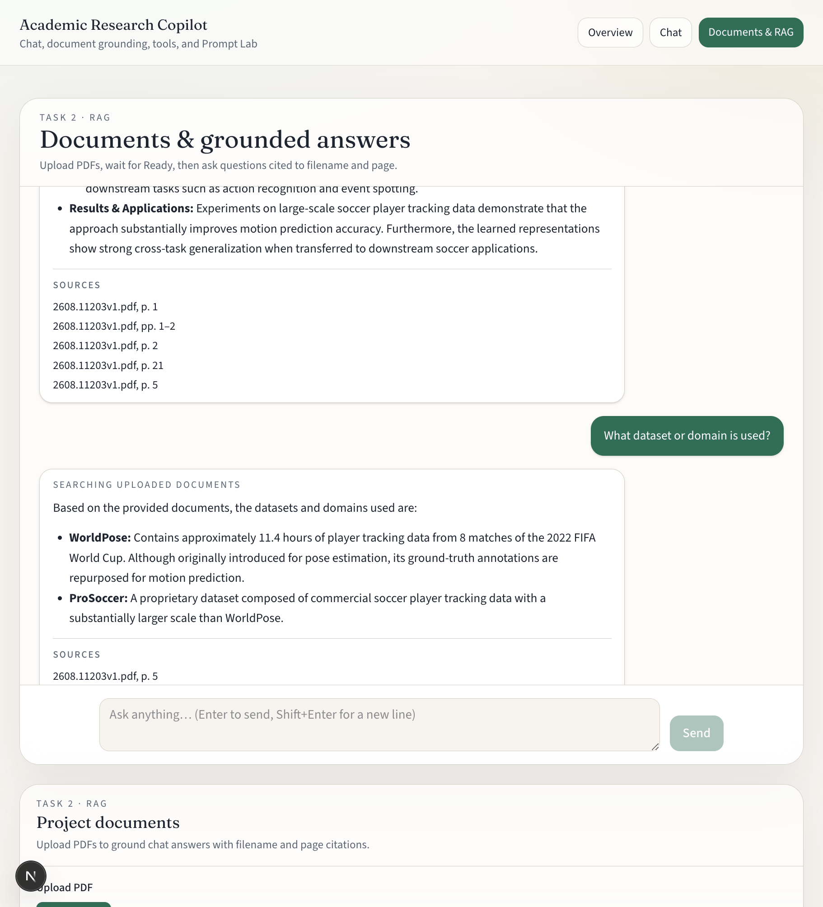

# Academic Research Copilot

AI-assisted research web app for students and researchers: LLM chat, project-scoped PDF RAG with citations, tool-calling agent, Prompt Lab, and a unified workspace.

**Current milestone: Task 5 — Complete AI Assistant**

The product now combines Tasks 1–4 in one assistant: chat with history, PDF upload and grounded answers, calculator / weather / web search, Prompt Lab, Docker, and a deploy path.

## Objectives (Task 5)

- Ship one assistant that supports chat, conversation history, tool calling, PDF upload, RAG, and safe errors
- Provide a modern unified workspace (plus the earlier focused demo pages)
- Make the stack runnable with Docker Compose
- Document deploy, demo, and portfolio artifacts

## Features

- Unified **workspace** (`/workspace`) with history, documents, and auto routing
- Chat UI with Enter-to-send / Shift+Enter newline
- Loading indicator and safe API error messages
- Conversation history in **Prisma Postgres** (list, switch, new chat; first message retitles)
- PDF upload panel with indexing status, retry, and delete confirmation
- Grounded RAG answers with `Filename.pdf, p. N` citations
- Insufficient-evidence replies when retrieved context is too weak
- Agent router for calculator, weather, and web search
- Prompt Lab (`/prompt-lab`) with versioned templates, side-by-side results, and 1–5 ratings
- Google Gemini for generation, embeddings, and constrained JSON routing (server-side only)
- Docker Compose: Next.js, FastAPI, PostgreSQL + pgvector
- Dev identity via `X-User-Id` (browser localStorage)

## Technologies

| Layer | Stack |
|---|---|
| Frontend | Next.js (App Router), TypeScript, Tailwind CSS |
| Backend | FastAPI, Pydantic, SQLAlchemy |
| LLM / embeddings | Google Gemini (`gemini-flash-lite-latest`, `gemini-embedding-001`) |
| Agent tools | Safe AST calculator, Open-Meteo weather, DuckDuckGo HTML search (Tavily if `WEB_SEARCH_API_KEY` is set) |
| Prompt Lab | Versioned templates in `apps/ai-service/app/prompts` |
| Database | Prisma Postgres + pgvector (Compose uses local `pgvector/pgvector`) |
| PDF | PyMuPDF |
| Storage | Local filesystem object storage (`STORAGE_LOCAL_ROOT`) |
| Runtime | Docker Compose + GitHub Actions CI |

## Repository layout

```text
academic-research-copilot/
├── apps/
│   ├── web/           # Next.js frontend + Prisma schema/migrations
│   └── ai-service/    # FastAPI AI service (chat + RAG + agent + Prompt Lab)
├── docs/              # Architecture, API, deploy, demos, screenshots
├── Tasks/             # Program task briefs
├── docker-compose.yml
├── .env.example
├── AGENTS.md
└── README.md
```

## Local setup

### Option A — Docker Compose

```bash
cp .env.example .env
# Set GEMINI_API_KEY in .env
docker compose up --build
```

Open [http://localhost:3000](http://localhost:3000). Compose starts Postgres, applies Prisma migrations, then the AI service and web app.

### Option B — Separate processes

```bash
cp .env.example .env
cp apps/web/.env.local.example apps/web/.env.local
```

In root `.env`, set:

- `GEMINI_API_KEY` — from [Google AI Studio](https://aistudio.google.com/apikey)
- `DATABASE_URL` — Prisma Postgres connection string (also in `apps/web/.env` after `prisma postgres link`)
- `STORAGE_LOCAL_ROOT=.data/uploads` (default local PDF storage)
- Optional: `WEB_SEARCH_API_KEY` for Tavily. Default search uses DuckDuckGo HTML results (real ranked links), then Instant Answer. Gemini Google Search grounding is last so it does not burn chat quota first.
- Weather uses Open-Meteo and does not require a key

Never put secrets in `NEXT_PUBLIC_*` variables.

Optional demo escape hatches (never in production): `DEV_FAKE_LLM=true`, `DEV_FAKE_EMBEDDINGS=true`.

```bash
cd apps/web
npx prisma migrate deploy
```

```bash
cd apps/ai-service
python3 -m venv .venv
source .venv/bin/activate
pip install -e '.[dev]'
uvicorn app.main:app --reload --port 8000
```

```bash
cd apps/web
npm install
npm run dev
```

Open [http://localhost:3000](http://localhost:3000).

- `/` — product overview
- `/workspace` — complete assistant (history + documents + auto tools)
- `/chat` — Task 1 general chat (`mode=llm`)
- `/rag` — Task 2 PDF upload + grounded answers (`mode=rag`)
- `/agent` — Task 3 tool-calling agent (`mode=auto`)
- `/prompt-lab` — Task 4 prompting comparison

## How to try the complete assistant

1. Open `/workspace`.
2. Upload a text-based PDF and wait until **Ready for search**.
3. Ask a question the PDF can answer — expect **Searching uploaded documents** and a source/page citation.
4. Start a new chat and ask `What is 12 * (3 + 4)?` — expect **Using calculator** and **84**. The sidebar title updates from the question.
5. Ask `What's the weather in Paris?` or `Search the web for retrieval-augmented generation` — expect a labeled external tool, not a document citation.

Focused walkthroughs for Prompt Lab and individual tools remain on `/prompt-lab` and `/agent`.

## Tests

```bash
# Backend (fake LLM, embeddings, weather, and search — no live provider calls)
cd apps/ai-service && source .venv/bin/activate && pytest

# Frontend
cd apps/web && npm test
```

CI runs the same checks on pull requests (`.github/workflows/ci.yml`).

## Screenshots

Task 1:





Task 2:







Task 3 architecture:


Capture workspace shots as `docs/screenshots/task5-*.png` (see [`docs/screenshots/README.md`](docs/screenshots/README.md)).

## Demo

Follow [`docs/demo-script.md`](docs/demo-script.md) for a 2–3 minute complete-assistant walkthrough.

## Deploy

Production: two **Vercel Hobby** projects from this repo — `apps/web` (Next.js) and `apps/ai-service` (FastAPI) — plus Prisma Postgres. Step-by-step: [`docs/deploy.md`](docs/deploy.md).

**Live application:** _add after deploy_

**GitHub:** https://github.com/ahmedmsabha/academic-research-copilot

## Project structure notes

- `apps/web/app/workspace` — complete assistant page
- `apps/web/features/chat` — chat panel, history sidebar, composer, citations, web sources
- `apps/web/features/documents` — PDF upload, status polling, delete/retry
- `apps/web/features/prompt-lab` — comparison UI, ratings, prompt library
- `apps/ai-service/app/agent` — constrained route selection
- `apps/ai-service/app/prompts` — versioned Prompt Lab templates
- `apps/ai-service/app/tools` — calculator, weather, web search
- `apps/ai-service/app/providers` — LLM, embeddings, storage, weather, search adapters
- `apps/ai-service/app/rag` — extract, chunk, citations, similarity helpers
- `apps/web/prisma/` — schema + migrations (including pgvector and prompt experiments)

## Known limitations (Task 5)

- Auth is a development `X-User-Id` header (not multi-user production auth)
- PDF storage is local filesystem (R2/Supabase remains a later upgrade)
- Image-only/scanned PDFs without text are rejected (OCR is future work)
- Web search uses DuckDuckGo HTML results by default. Instant Answer is sparse; Gemini search is last because it shares chat quota. Set `WEB_SEARCH_API_KEY` (Tavily) for a dedicated search API.
- Weather geocoding uses the top Open-Meteo match; ambiguous place names may need a country
- Prompt Lab cost is not estimated; token counts appear only when Gemini returns usage metadata
- Visible step-by-step is pedagogical CoT in the answer, not a hidden model scratchpad
- Starter Prisma `User`/`Post` models still coexist and can be removed later
- A public live URL is added after you complete [`docs/deploy.md`](docs/deploy.md)

## Guides

- [`AGENTS.md`](AGENTS.md)
- [`apps/web/AGENTS.md`](apps/web/AGENTS.md)
- [`apps/ai-service/AGENTS.md`](apps/ai-service/AGENTS.md)
- [`docs/architecture.md`](docs/architecture.md)
- [`docs/api.md`](docs/api.md)
- [`docs/deploy.md`](docs/deploy.md)
- [`docs/presentation.md`](docs/presentation.md)
- [`docs/prompt-comparison-report.md`](docs/prompt-comparison-report.md)
- [`docs/prompt-library.md`](docs/prompt-library.md)
- [`docs/linkedin-task5-draft.md`](docs/linkedin-task5-draft.md)
