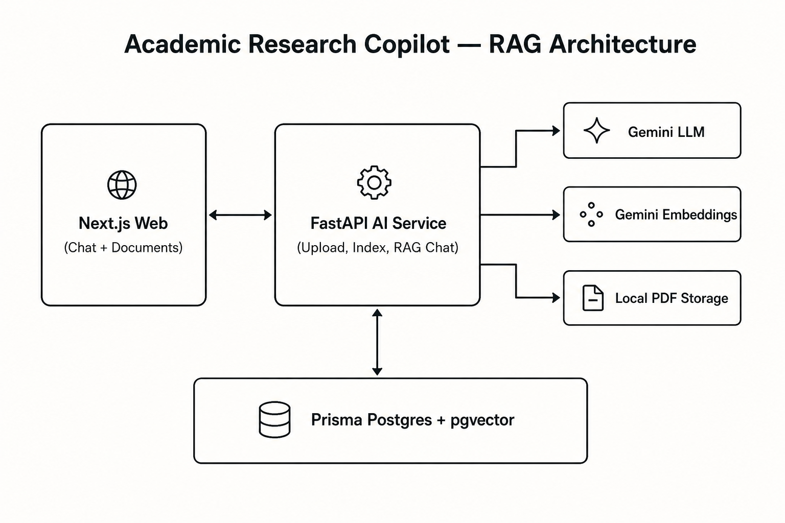

# Academic Research Copilot

AI-assisted research web app for students and researchers: LLM chat, project-scoped PDF RAG with citations, tool-calling agent, and a Prompt Lab.

**Current milestone: Task 2 — RAG System**

Upload PDFs, index them with embeddings in PostgreSQL/pgvector, and ask grounded questions that cite filename and page.

## Objectives (Task 2)

- Extract text from PDFs (page-aware)
- Split documents into overlapping chunks
- Generate embeddings (Gemini `gemini-embedding-001`)
- Store vectors in PostgreSQL with pgvector
- Retrieve relevant chunks for a question
- Generate context-aware answers with verified citations

## Features

- Chat UI with Enter-to-send / Shift+Enter newline
- Loading indicator and safe API error messages
- Conversation history in **Prisma Postgres**
- PDF upload panel with indexing status, retry, and delete confirmation
- Grounded RAG answers when the project has ready documents
- Citations formatted as `Filename.pdf, p. N` from retrieval metadata
- Insufficient-evidence replies when retrieved context is too weak
- Google Gemini for generation and embeddings (server-side only)
- Dev identity via `X-User-Id` (real auth in Task 5)

## Technologies

| Layer | Stack |
|---|---|
| Frontend | Next.js (App Router), TypeScript, Tailwind CSS |
| Backend | FastAPI, Pydantic, SQLAlchemy |
| LLM / embeddings | Google Gemini (`gemini-flash-lite-latest`, `gemini-embedding-001`) |
| Database | Prisma Postgres + pgvector |
| PDF | PyMuPDF |
| Storage (Task 2) | Local filesystem object storage (`STORAGE_LOCAL_ROOT`) |

## Repository layout

```text
academic-research-copilot/
├── apps/
│   ├── web/           # Next.js frontend + Prisma schema/migrations
│   └── ai-service/    # FastAPI AI service (chat + RAG)
├── docs/              # Architecture, API, demos, screenshots
├── Tasks/             # Program task briefs
├── .env.example
├── AGENTS.md
└── README.md
```

## Local setup

### 1. Environment

```bash
cp .env.example .env
cp apps/web/.env.local.example apps/web/.env.local
```

In root `.env`, set:

- `GEMINI_API_KEY` — from [Google AI Studio](https://aistudio.google.com/apikey)
- `DATABASE_URL` — Prisma Postgres connection string (also in `apps/web/.env` after `prisma postgres link`)
- `STORAGE_LOCAL_ROOT=.data/uploads` (default local PDF storage)

Never put secrets in `NEXT_PUBLIC_*` variables.

Optional demo escape hatches (never in production): `DEV_FAKE_LLM=true`, `DEV_FAKE_EMBEDDINGS=true`.

### 2. Database migration

```bash
cd apps/web
npx prisma migrate deploy
```

This enables the `vector` extension and creates `documents` / `document_chunks` tables.

### 3. AI service

```bash
cd apps/ai-service
python3 -m venv .venv
source .venv/bin/activate
pip install -e '.[dev]'
uvicorn app.main:app --reload --port 8000
```

### 4. Web app

```bash
cd apps/web
npm install
npm run dev
```

Open [http://localhost:3000](http://localhost:3000).

- `/` — feature overview
- `/chat` — Task 1 general chat
- `/rag` — Task 2 PDF upload + grounded answers

## How to try RAG

1. Open `/rag` and upload a text-based PDF in the documents panel.
2. Wait until status is **Ready for search**.
3. Ask a question the PDF can answer — expect route status “Searching uploaded documents” and a source/page citation.
4. Ask something unrelated — expect an honest insufficient-evidence reply.
5. Use `/chat` anytime for general Task 1 conversation (does not depend on documents).

## Tests

```bash
# Backend (fake LLM + fake embeddings — no live Gemini calls)
cd apps/ai-service && source .venv/bin/activate && pytest

# Frontend
cd apps/web && npm test
```

## Screenshots

Task 1:


Task 2:


Architecture:



## Demo

Follow [`docs/demo-script.md`](docs/demo-script.md) for a 2–3 minute walkthrough.

## Project structure notes

- `apps/web/features/chat` — chat panel, composer, message list + citations
- `apps/web/features/documents` — PDF upload, status polling, delete/retry
- `apps/ai-service/app/rag` — extract, chunk, citations, similarity helpers
- `apps/ai-service/app/providers` — LLM, embeddings, local storage adapters
- `apps/ai-service/app/services/documents.py` — upload/index/delete pipeline
- `apps/web/prisma/` — schema + migrations (including pgvector)

## Known limitations (Task 2)

- Auth is a development `X-User-Id` header (not production auth)
- PDF storage is local filesystem (R2/Supabase in a later milestone)
- Image-only/scanned PDFs without text are rejected (OCR is future work)
- No tool routing yet (Task 3)
- Starter Prisma `User`/`Post` models still coexist and can be removed later

## Guides

- [`AGENTS.md`](AGENTS.md)
- [`apps/web/AGENTS.md`](apps/web/AGENTS.md)
- [`apps/ai-service/AGENTS.md`](apps/ai-service/AGENTS.md)
- [`docs/architecture.md`](docs/architecture.md)
- [`docs/api.md`](docs/api.md)
- [`docs/linkedin-task2-draft.md`](docs/linkedin-task2-draft.md)

## Roadmap

- Task 3: Agent router + calculator / weather / web search
- Task 4: Prompt Lab
- Task 5: Unified UI, Docker, deploy, full portfolio package
